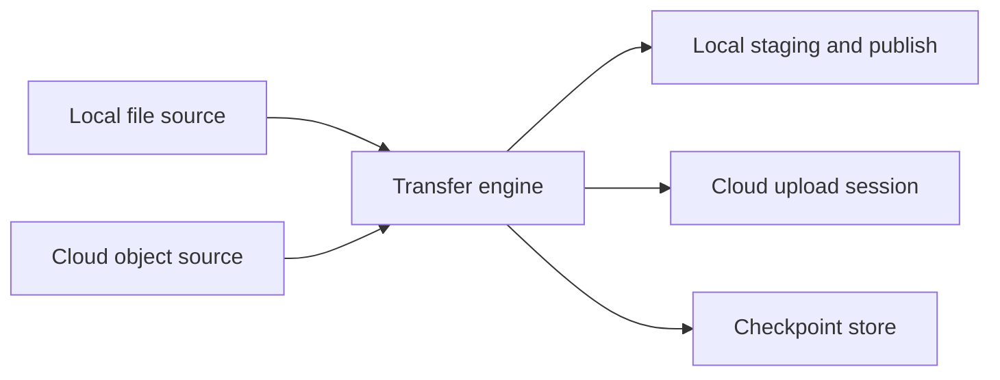

# waybill

<p align="center">
  
</p>

<p align="center">
  <strong>Resumable delivery. Both ways.</strong><br>
  A Rust library for moving files between local storage and the cloud.
</p>

<p align="center">
  <a href="README.zh-CN.md">简体中文</a> ·
  <a href="docs/DESIGN.zh-CN.md">Design</a> ·
  <a href="docs/BRAND.zh-CN.md">Meet Bill</a> ·
  <a href="https://github.com/yexiyue/waybill/actions/workflows/ci.yml">CI</a>
</p>

> **Early development · M0 contract design.** This repository currently contains
> a Rust workspace scaffold and design documentation. There is no public transfer
> API, implemented service, or crates.io release yet. The capabilities below
> describe the intended design.

## Delivery that can pick up where it stopped

A large transfer can outlive its process. A connection drops, an app restarts,
or the destination becomes unavailable just as the file is ready to publish.
waybill is being designed to preserve enough state to continue safely.

The name comes from a **waybill**: the document that travels with a shipment,
recording its identity, progress, and delivery receipt.

| Design goal | What it means |
|---|---|
| **Durable recovery** | Versioned checkpoints bind progress to a source and destination. Recovery reconciles persisted data or the remote session before continuing. |
| **Receipt-based retries** | An operation ID and completion evidence help retries converge, within each service's guarantees. |
| **Bounded resources** | Chunk sizes, concurrency, prefetch, and buffers share an explicit budget. |
| **Honest capabilities** | Upload recovery, download recovery, version checks, and publishing guarantees are declared separately. |

For downloads, the planned lifecycle is: read missing ranges, write a local
.part file, persist confirmed progress, validate, then publish. A failed publish
keeps staging data available for another attempt.

For uploads, the service determines whether recovery uses a continuous offset,
multipart state, or a full restart. A caller that requires durable recovery can
reject an unsuitable service before starting.

## One engine, independently implemented services



The planned core defines Service, Source, and Sink contracts, capabilities,
checkpoints, credentials, and transfer scheduling. Each service implements a
backend through those public contracts.

**The services maintained here use the same extension boundary as services
written by other developers.** An external service should be able to live in its
own crate, depend on waybill, and be injected without adding a provider enum
variant or changing the engine.

| Planned service | Role |
|---|---|
| waybill-service-fs | Local range reads, offset writes, staging, persistence, and final publication |
| waybill-service-gdrive | Google Drive access and resumable upload sessions |
| waybill-service-webdav | Streaming uploads, range downloads, and declared server capabilities |
| waybill-service-oss | Aliyun OSS access, multipart sessions, and part reconciliation |
| External service crates | Additional backends using the same public extension contracts |

A read-only service can participate without implementing uploads. Durable
recovery is an optional contract with explicit requirements. Shared examples
and capability-driven conformance tools are planned to make service development
easier.

See the [extension design](docs/DESIGN.zh-CN.md#57-第三方-service-的公开扩展契约).
API names and signatures are still under design.

## Working with the Rust storage ecosystem

The design draws on access and multipart primitives from OpenDAL and
object_store. Protocol clients, HTTP transports, and signing libraries can be
reused while waybill owns the transfer lifecycle and its recovery state.

An optional OpenDAL service may follow a concrete demand for another backend.
Range reads and source-version checks can be combined with local checkpoints
for download recovery. Upload-session recovery needs separate backend support.

Each service declares its guarantees. A WebDAV MOVE, an object key, or an ETag
alone does not establish universal atomicity, content integrity, or exactly-once
delivery. The [design document](docs/DESIGN.zh-CN.md) records the research and
proposed boundaries.

The initial scope is file delivery between local and cloud storage. Directory
sync, conflict merging, and multi-device synchronization are outside that scope.

## Roadmap

| Milestone | Planned outcome |
|---|---|
| **M0 — current** | Public extension contracts, capabilities, checkpoint envelope, and minimal service examples |
| **M1** | Local + Drive services; upload and download recovery; independent consumer integration |
| **M2** | WebDAV service and a real-server compatibility matrix |
| **M3** | OSS service; multipart recovery and completion reconciliation |
| **On demand** | OpenDAL adapter, starting with a concrete additional backend and its download path |

The first intended consumer is
[SwarmDrop](https://github.com/swarm-apps/SwarmDrop). Its existing local-file and
Drive delivery implementations provide the starting material. waybill's public
contracts remain independent of its UI, device identity, and P2P protocol.

## Meet Bill

<p align="center">
  
</p>

**Bill**, known as **雁哥** in Chinese, is our courier goose. His two-way migration
fits the library's two-way delivery, and the tube on his leg keeps the waybill
close throughout the journey.

The [brand guide](docs/BRAND.zh-CN.md) includes the mascot, avatar, README banner,
social cover, and generation prompts.

## Contributing

Start with the [design document](docs/DESIGN.zh-CN.md). Contributions around the
public service boundary, recovery behavior, and real backend constraints are
especially useful at this stage.

The workspace uses **Rust 2024**, with a declared minimum Rust version of **1.85**.
To check the current scaffold:

```sh
cargo check --workspace
```

Please discuss a service's capabilities and recovery guarantees before building
against the API sketches. The sketches are design material and may change.

## License

Licensed under [MIT](LICENSE-MIT) or [Apache-2.0](LICENSE-APACHE), at your option.
