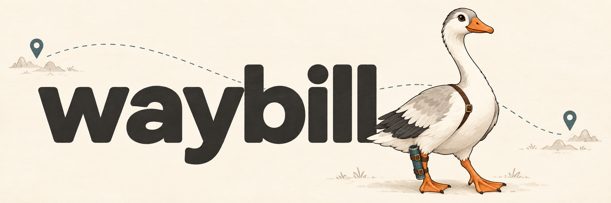

# waybill

<p align="center">
  
</p>

<p align="center">
  <strong>Resumable delivery. Both ways.</strong><br>
  A Rust file transfer library and CLI connecting local storage with the cloud.
</p>

<p align="center">
  <a href="README.zh-CN.md">简体中文</a> ·
  <a href="docs/DESIGN.zh-CN.md">Design</a> ·
  <a href="docs/STATUS.zh-CN.md">Project status</a> ·
  <a href="https://github.com/yexiyue/waybill/actions/workflows/ci.yml">CI</a>
</p>

waybill saves durable progress and completion receipts for uploads and downloads.
After an interruption, rerun the same command to validate the source and saved
state, then continue the transfer or reuse the completed result.

Use `wb` to manage Google Drive files, or embed transfers in an application through
the public Rust interfaces. The name comes from the document that travels with a
shipment; [Bill](docs/BRAND.zh-CN.md) is our courier goose.

## Features

- **Two-way transfers**: Google Drive uploads, downloads, and directory browsing.
- **Durable recovery**: checkpoints reconcile source versions, remote sessions, or local staging data before resuming.
- **Interactive selection**: named drives, default roots, local and cloud file selection, and a fullscreen transfer dashboard.
- **Scripting**: complete arguments run directly, with line-delimited JSON events and plain progress output.
- **Safe publication**: download verification and same-filesystem publication without overwriting; failed publication retains retryable state.
- **Open extensions**: independent services declare their capabilities and recovery guarantees through public contracts.

waybill handles file delivery. Directory synchronization, conflict merging, and
multi-device synchronization are outside the current feature set.

## Installation

Supports Linux and macOS. Requires **Rust 1.88 or newer**. Install `wb` from source:

```sh
git clone https://github.com/yexiyue/waybill.git
cd waybill
cargo install --path crates/waybill-cli --locked
wb --help
```

Inside the repository, you can also use `cargo run -p waybill-cli -- <command>`.
No stable release has been published, and public APIs may change. Release plans
and validation coverage are recorded in [project status](docs/STATUS.zh-CN.md).

## Quick start

Prepare a Google OAuth **desktop application** client JSON and enable the Drive
API in its Google Cloud project. Sign in, then configure a drive with your account:

```sh
wb login gdrive --client /path/to/desktop.json
wb drive add personal --account account@example.com
```

Replace `account@example.com` with your Google account email, or the alias supplied
with `login --account`. The first drive becomes the default. Choose a cloud folder
as the starting point for subsequent short paths:

```sh
wb drive root personal
```

You can now work without repeating a full cloud URI:

```sh
wb list                       # Browse the default drive
wb put                        # Select local files, then a cloud destination
wb get --into ~/Downloads     # Select cloud files for an existing local directory
wb status                     # Inspect pending records and completion receipts
```

Authorization uses `drive.file` to create and modify app-owned files and
`drive.readonly` to read Drive. Credentials stay in a private local directory;
upload destinations must still satisfy Google Drive's app access permissions.

## Commands and interaction

| Command | Purpose |
|---|---|
| `wb login gdrive` | Sign in to Google Drive |
| `wb drive add / list / use / root / remove` | Manage named drives, the default drive, and roots |
| `wb list [PATH]` | List a directory, or browse interactively without a path |
| `wb put [SRC…] --to PATH` | Upload files; select missing sources or destinations interactively |
| `wb get [SOURCE] [DEST]` | Download files; select missing sources or destinations interactively |
| `wb status` | List local recovery records and completion receipts |

In a picker, Enter opens a folder, Space selects files, `c` confirms, ← / Backspace
goes up, and `q` / Esc / Ctrl-C cancels. Selections persist across folders.

Transfers show a fullscreen dashboard by default; `--no-tui` uses plain output.
The first Ctrl-C stops gracefully, and the second aborts immediately. Keep the
source files, drive configuration, and local records to resume with the same command.

### Direct commands and scripts

Complete arguments run a transfer directly. Paths are relative to the selected
drive's default root; `/` means that root. A batch upload destination ends in `/`.

```sh
wb put ./a.zip ./b.zip --to backup/
wb list backup/
wb get backup/a.zip ./a.zip
wb --drive work list /
wb --json put ./a.zip --to backup/
wb get backup/a.zip ./a.zip --no-tui
```

`--drive NAME` selects a drive for one command; `--root ID` overrides its root.
`wb drive use NAME` changes the default. `wb drive remove NAME` keeps credentials
and recovery records.

An explicit account and full URI also work:

```sh
wb get 'gdrive://account@example.com/backup/a.zip' ./a.zip
```

Full URIs start at the Google root unless overridden with `--root`, and cannot be
combined with `--drive`. JSON output, `--no-tui`, and non-terminal sessions never
open a picker; missing required arguments produce an error. See
`wb <command> --help` for all options.

### Files and publication

Batch downloads require an existing local directory. Identical names from
different cloud folders are rejected before transferring. Google native documents
can be browsed but are not exported, and folders are not downloaded recursively.
Downloads publish on the same filesystem without overwriting existing files;
cross-filesystem copy publication is unsupported. Use `--conflict operation-suffix`
to keep another copy when a name conflicts.

## Rust integration

| Crate | Responsibility |
|---|---|
| [`waybill`](crates/waybill/) | Upload and download contracts, transfer engines, capabilities, and checkpoints |
| [`waybill-service-fs`](crates/waybill-service-fs/) | Stable local sources, file checkpoints, download staging, and publication |
| [`waybill-service-gdrive`](crates/waybill-service-gdrive/) | Google Drive protocol, upload reconciliation, ranged reads, and directory access |
| [`waybill-cli`](crates/waybill-cli/) | `wb`: authorization, drive configuration, interaction, and transfer orchestration |

The core is independent of backends and executors. Hosts own authorization and
credential refresh; services obtain valid credentials at request boundaries.
External services use the same public interfaces as the services in this workspace,
implementing uploads, downloads, and recovery according to their capabilities.

Start with the [independent consumer example](examples/consumer/), or read the
[service guide](docs/SERVICE.zh-CN.md) and [design document](docs/DESIGN.zh-CN.md).
The detailed documentation is currently in Simplified Chinese.

## Contributing

Issues and pull requests are welcome. For recovery changes or new backends,
describe the use case, backend capabilities, and expected behavior after failure.
The [design document](docs/DESIGN.zh-CN.md) records architectural constraints.

The workspace uses Rust 2024. Before submitting a change, run:

```sh
cargo fmt --all -- --check
cargo check --workspace --all-targets --locked
cargo clippy --workspace --all-targets --locked -- -D warnings
cargo test --workspace --locked
```

Use dedicated files and folders for live backend tests. Keep credentials and
private session state out of contributions. Existing validation and remaining
test scenarios are recorded in the [validation notes](docs/VALIDATION.zh-CN.md).

## License

Licensed under [MIT](LICENSE-MIT) or [Apache-2.0](LICENSE-APACHE), at your option.
