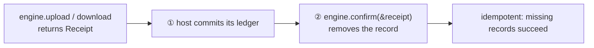

# waybill

<p align="center">
  
</p>

<p align="center">
  <strong>Resumable delivery. Both ways.</strong><br>
  A Rust library for resumable file transfer: durable progress, completion receipts, and open backend contracts.
</p>

<p align="center">
  <a href="README.zh-CN.md">简体中文</a> ·
  <a href="docs/DESIGN.zh-CN.md">Design</a> ·
  <a href="docs/SERVICE.zh-CN.md">Service guide</a> ·
  <a href="docs/STATUS.zh-CN.md">Project status</a> ·
  <a href="https://github.com/yexiyue/waybill/actions/workflows/ci.yml">CI</a>
</p>

waybill models a file transfer as a waybill: a recovery record is persisted before
work starts, only **confirmed** progress is recorded along the way, and completion
returns a receipt you can book. After an interruption, rerun with the same
operation ID: the engine first reconciles the source version, the remote session,
or local staging, then resumes, retries publication, or reuses the completed
result.

The [`wb`](#wb-the-first-integrator) command line is the first application built
on this public API; you can assemble the same transfer capability inside your own
program. The name comes from the document that travels with a shipment;
[Bill](docs/BRAND.zh-CN.md) is our courier goose.

## Design highlights

- **Persist before advancing**: an offset or interval is recorded only after data is written and synced; reaching 100% is not completion — a durable receipt is.
- **Never guess remote outcomes**: unknown request results return `ResultUnknown` with the record preserved; recovery always reconciles first; expired sessions wait for an explicit decision.
- **Graded evidence**: receipts carry `Unverified / Length / Digest` verification evidence; client-submitted hashes never impersonate server-side content verification.
- **Bounded throughout**: chunk size, concurrency, checkpoint size, and directory responses all have upper bounds; engines can share one resource budget.
- **Open contracts**: the core knows no backend; services join through an open namespace and declare per-instance capabilities, rejecting unsupported ports instead of defaulting to success.

Directory synchronization, conflict merging, and multi-device synchronization are
outside the current feature set.

## Crates

| Crate | Responsibility |
|---|---|
| [`waybill`](crates/waybill/) | Public contracts, upload / download state machines, checkpoints, receipts, and the resource budget |
| [`waybill-service-fs`](crates/waybill-service-fs/) | Stable local sources, file checkpoints, download staging, and publication (Linux / macOS) |
| [`waybill-service-gdrive`](crates/waybill-service-gdrive/) | Google Drive protocol, upload reconciliation, directory access, and ranged downloads |
| [`waybill-service-webdav`](crates/waybill-service-webdav/) | WebDAV directory access and ranged reads, whole-file streaming upload, content reconciliation, and conditional MOVE |
| [`waybill-service-opendal`](crates/waybill-service-opendal/) | OpenDAL object storage browsing, conditional downloads, streaming upload, and completion reconciliation |
| [`waybill-cli`](crates/waybill-cli/) | `wb`: authorization, drive configuration, interaction, and transfer orchestration (below) |

The core depends only on `serde / thiserror / futures-util` — no HTTP client,
executor, or backend. Hosts own authorization and credential refresh; services
obtain valid credentials at request boundaries.

## Library setup

The project is 0.x, unpublished on crates.io, and public APIs may change. Add it
as a git dependency; **Rust 1.91+** (edition 2024) is required. The services are
native implementations, so hosts bring their own Tokio runtime:

```toml
[dependencies]
waybill = { git = "https://github.com/yexiyue/waybill" }
waybill-service-fs = { git = "https://github.com/yexiyue/waybill" }
waybill-service-gdrive = { git = "https://github.com/yexiyue/waybill" }
# add waybill-service-webdav / waybill-service-opendal as needed
tokio = { version = "1", features = ["full"] }
```

`waybill-service-opendal` enables S3, OSS, COS, OBS, TOS, GCS, Azure Blob, B2,
Swift, Upyun, and Vercel Blob by default; library consumers can trim it with
`default-features = false` plus individual features.

## Core model

Three roles with strict ownership:

- **Host (your application)**: OAuth and credential refresh, the business ledger, stop signals, and progress consumption.
- **`waybill` core**: the transfer state machines, checkpoints, receipt validation, and the resource budget.
- **Services**: protocol and IO, implementing ports along the `prepare / probe / initialize / write / verify / publish` lifecycle.

Construct a `TransferEngine::new(store)` once and reuse it; four methods cover
every operation:

| Method | Purpose |
|---|---|
| `engine.upload(source, sink, options)` | Offset-resumable upload (GDrive and similar backends) |
| `engine.upload_stream(source, sink, options)` | Bounded whole-file streaming upload (WebDAV / object storage) |
| `engine.download(source, target, options)` | Download to a local target |
| `engine.confirm(&receipt)` | Clean up the recovery record after the ledger commit (idempotent) |

Completion is two-phase: the engine persists the receipt **into the checkpoint**
before returning success, and the host calls `confirm` with that same receipt
after committing its ledger.



### Upload to Google Drive

```rust
use std::sync::Arc;
use waybill::{TransferEngine, UploadOptions, service::Service};
use waybill_service_fs::{FileCheckpointStore, FsService};
use waybill_service_gdrive::{Gdrive, GdriveConfig, credential::TokenProvider};

async fn deliver(
    tokens: Arc<dyn TokenProvider>,
    ledger: &mut Ledger,
) -> waybill::error::Result<()> {
    let local = FsService::new("my-host")?;
    // Opens and fully hashes the source; the host must freeze it during upload
    let source = local.source("/data/report.zip").await?;

    // The host owns OAuth; the service fetches valid credentials per request
    let drive = Gdrive::new(
        GdriveConfig {
            account: "user@example.com".into(),
            oauth_application: "my-app".into(),
            root: "1AbC_folder-id".into(),
        },
        tokens,
    )?;

    let engine = TransferEngine::new(FileCheckpointStore::new("/var/lib/myapp/waybill"));
    let receipt = engine
        .upload(
            source.as_ref(),
            drive.upload_sink()?.as_ref(),
            UploadOptions::new("report-20261002", "backup/report.zip"),
        )
        .await?;

    ledger.commit(&receipt)?;        // ① ledger first
    engine.confirm(&receipt).await?; // ② then clean up
    Ok(())
}
```

After an interruption, rerun `engine.upload` with the same operation: the engine
reconciles the remote session and completed object, then continues from the
server-confirmed offset. For pause, progress, or conflict handling, adjust the
options:

```rust
use waybill::transfer::{ConflictPolicy, StopToken};

let mut options = UploadOptions::new("report-20261002", "backup/report.zip");
options.progress = Some(&|p| {
    println!("persisted {}/{} (complete: {})", p.persisted, p.total, p.complete);
});
options.stop = stop_token.clone(); // preserves the record and returns Paused
options.intent.conflict = ConflictPolicy::OperationSuffix; // suffix on name clash
```

### Download from the cloud

```rust
use std::sync::Arc;
use waybill::download::DownloadOptions;
use waybill::service::Service;

let backend: Arc<dyn Service> = Arc::new(drive); // hold it as a trait object, backend-neutral
let target = local.download_target()?; // LocalTarget: .part random writes, verification, atomic publish
let entries = backend.list(&root_folder_id).await?; // Vec<ObjectMetadata>
let entry = entries.iter().find(|o| o.name == "report.zip").unwrap();

let receipt = engine
    .download(
        backend.download_source(&entry.reference).await?.as_ref(),
        target.as_ref(),
        DownloadOptions::new("fetch-report-0001", "/data/downloads/report.zip"),
    )
    .await?;
```

- The download target is interpreted by the target service; service-fs requires an **absolute path**, publishes on the same filesystem without overwriting, and does not support cross-filesystem copy publication.
- The engine fills holes with bounded parallelism under the shared budget; `.part` length is not completion evidence — the interval ledger is — and failed publication retries publication alone.

### Whole-file streaming upload (WebDAV / object storage)

Plain WebDAV PUT and object storage multipart offer no offset resume, so they use
the separate whole-file port:

```rust
use waybill_service_webdav::{Webdav, WebdavConfig};

let dav = Webdav::new(
    WebdavConfig::new("https://dav.example.com/files/", "alice"),
    credentials, // Arc<dyn credential::CredentialProvider>
)?;
let mut options = UploadOptions::new("report-0007", "backup/report.zip");
options.policy.allow_restart = true; // explicitly allow whole-file retransmission
let receipt = engine
    .upload_stream(source, dav.stream_upload_sink()?.as_ref(), options) // source: Arc<dyn Source>
    .await?;
```

Verified staging retries publication only, without retransmission; silent
whole-file restarts after interruption are not allowed by default.

### Object storage (Apache OpenDAL)

The host builds an `Operator` the usual OpenDAL way (credential refresh belongs
to the Operator), wraps it into this service, and then shares the same `Service`
ports with every other backend:

```rust
use waybill_service_opendal::{ObjectStorage, ObjectStorageConfig};

let storage = ObjectStorage::new(operator, ObjectStorageConfig::new("prod-namespace"))?;
let source = storage.download_source("backup/report.zip").await?;
let meta = storage.resolve("backup/").await?; // ObjectMetadata
```

Uploads are off by default; set `conditional_writes: true` after confirming the
server enforces conditional creation. Backend registration does not imply every
delivery capability; see the [configuration and acceptance guide](docs/object-storage.zh-CN.md).

### Browsing and read-only access

`Service::resolve(path)` and `Service::list(reference)` provide optional
directory access and return `ObjectMetadata` (the `reference` is the recovery
identity; display names are not). A minimal service implements only `Source`:

```rust
let service: Arc<dyn Service> = my_readonly_service();
let source = service.source("demo").await?;
let identity = source.identity().await?; // size, revision, and BLAKE3
```

### Recovery, errors, and resources

- **Operation IDs**: 1..=128 bytes of ASCII alphanumerics and `-_.:`; an operation must not change source or target — checkpoints bind both identities plus the format version.
- **Recovery actions**: match on `ErrorKind` (non_exhaustive) — `Paused` keeps the record, `SourceChanged` refuses recovery, `SessionExpired` awaits `allow_restart`, `ResultUnknown` reconciles first, `Authentication` returns to the host for credential refresh.
- **Diagnostic safety**: error messages contain only controlled static text; details live in the source chain without credentials or session URIs.
- **Resource budget**: `ResourceBudget` bounds shared memory (chunks ≤ 32 MiB, concurrency ≤ 16); `engine.with_budget(Arc::new(budget))` shares one gate across engines.

### Writing your own service

External crates integrate new backends using only the public contracts — no core
enum changes or private helpers. Start with `Service` + `Source`, implement
upload / download per actual capability, and return `Unsupported` elsewhere. See
the [service guide](docs/SERVICE.zh-CN.md), the [design document](docs/DESIGN.zh-CN.md),
and [examples/consumer](examples/consumer/) (including a third-party read-only
service). The detailed documentation is currently in Simplified Chinese.

## `wb`: the first integrator

`wb` is assembled entirely through the public API above: OAuth, drive
configuration, interactive pickers, and the transfer dashboard live in the host
layer with no private core interfaces. It is both a daily command line tool and
the reference host integration.

### Installation

Supports Linux and macOS. Install from source:

```sh
git clone https://github.com/yexiyue/waybill.git
cd waybill
cargo install --path crates/waybill-cli --locked
wb --help
```

Inside the repository, you can also use `cargo run -p waybill-cli -- <command>`.

### Quick start (Google Drive)

Prepare a Google OAuth **desktop application** client JSON and enable the Drive
API in its Google Cloud project. Sign in, then configure a drive with your account:

```sh
wb login gdrive --client /path/to/desktop.json
wb drive add personal --account account@example.com
wb drive root personal   # pick the default root
```

Replace `account@example.com` with your Google account email, or the alias
supplied with `login --account`. The first drive becomes the default:

```sh
wb list                       # Browse the default drive
wb put                        # Select local files, then a cloud destination
wb get --into ~/Downloads     # Select cloud files for an existing local directory
wb status                     # Inspect pending records and completion receipts
```

Authorization uses `drive.file` to create and modify app-owned files and
`drive.readonly` to read Drive. Credentials stay in a private local directory;
upload destinations must still satisfy Google Drive's app access permissions.

### WebDAV

```sh
wb login --account nas webdav --endpoint https://dav.example.com/files/ --username alice
wb drive add nas --provider webdav --account nas
wb --drive nas put ./a.zip --to backup/
wb --drive nas get backup/a.zip ./a.zip
```

Enter the password interactively or read it with `--password-stdin`; `--auth digest`
/ `--auth anonymous` switch the scheme. The endpoint includes the server root; a
drive's `--root` is a relative directory below it. Interrupted plain PUT requires
`--allow-restart` to retransmit the whole file; verified staging retries
publication alone. See the [WebDAV validation notes](docs/webdav-acceptance.zh-CN.md)
for server requirements and the tested matrix.

### Object storage

```sh
wb login --account cloud object --config object.json
wb drive add cloud --provider object --account cloud
wb --drive cloud put ./model.bin --to models/ --no-tui
wb --drive cloud get models/model.bin ./downloaded.bin --no-tui
```

Configuration uses OpenDAL backend keys and supports `${ENV}` credential
references. Local RustFS / S3 Docker and real Aliyun OSS acceptance passed;
COS and other public clouds remain pending. See the
[configuration and acceptance guide](docs/object-storage.zh-CN.md).

### Commands and interaction

| Command | Purpose |
|---|---|
| `wb login gdrive / webdav / object` | Sign in or import an object storage configuration |
| `wb drive add / list / use / root / remove` | Manage named drives, the default drive, and roots |
| `wb list [PATH]` | List a directory, or browse interactively without a path |
| `wb put [SRC…] --to PATH` | Upload files; select missing sources or destinations interactively |
| `wb get [SOURCE] [DEST]` | Download files; select missing sources or destinations interactively |
| `wb status` | List local recovery records and completion receipts |

In a picker, Enter opens a folder, Space selects files, `c` confirms, ← / Backspace
goes up, and `q` / Esc / Ctrl-C cancels; selections persist across folders.
`wb status` opens a fullscreen local-record browser in a terminal (`--no-tui`
prints a list; `--json` retains the JSON array). Transfers show a fullscreen
dashboard by default and `--no-tui` uses plain output; the first Ctrl-C stops
gracefully and the second aborts immediately, keeping sources, drive
configuration, and local records — rerun the same command to resume.

### Direct commands and scripts

Complete arguments run a transfer directly. Paths are relative to the selected
drive's default root; `/` means that root, and a batch upload destination ends
in `/`:

```sh
wb put ./a.zip ./b.zip --to backup/
wb get backup/a.zip ./a.zip
wb --drive work list /
wb --json put ./a.zip --to backup/
```

`--drive NAME` selects a drive; `--root ROOT` overrides its root. An explicit
account and full URI also work:

```sh
wb get 'gdrive://account@example.com/backup/a.zip' ./a.zip
wb get 'webdav://nas/backup/a.zip' ./a.zip
```

Full URIs start at the account root and cannot be combined with `--drive`;
JSON output, `--no-tui`, and non-terminal sessions never open a picker. See
`wb <command> --help` for all options.

### Files and publication rules

Batch downloads require an existing local directory. Identical names from
different cloud folders are rejected before transferring. Google native documents
can be browsed but are not exported, and folders are not downloaded recursively.
Downloads publish on the same filesystem without overwriting existing files; use
`--conflict operation-suffix` to keep another copy when a name conflicts.

## Contributing

Issues and pull requests are welcome. For recovery changes or new backends,
describe the use case, backend capabilities, and expected behavior after failure.
The [design document](docs/DESIGN.zh-CN.md) records architectural constraints.

The workspace uses Rust 2024. Before submitting a change, run:

```sh
cargo fmt --all -- --check
cargo check --workspace --all-targets --locked
cargo clippy --workspace --all-targets --locked -- -D warnings
cargo test --workspace --locked
```

Use dedicated files and folders for live backend tests. Keep credentials and
private session state out of contributions. Existing validation and remaining
test scenarios are recorded in the [validation notes](docs/VALIDATION.zh-CN.md).

## License

Licensed under [MIT](LICENSE-MIT) or [Apache-2.0](LICENSE-APACHE), at your option.
