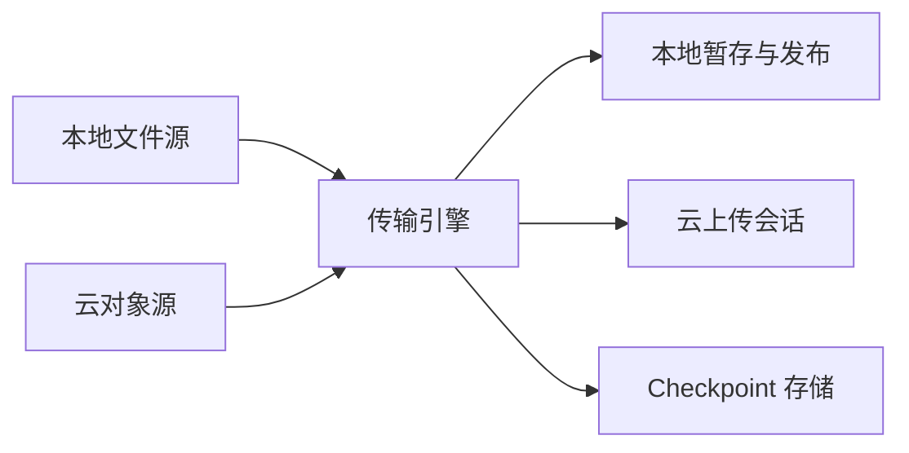

# waybill · 运单

<p align="center">
  
</p>

<p align="center">
  <strong>可恢复交付，往返皆可。</strong><br>
  用 Rust 构建云端与本地之间的双向文件传输。
</p>

<p align="center">
  <a href="README.md">English</a> ·
  <a href="docs/DESIGN.zh-CN.md">设计文档</a> ·
  <a href="docs/BRAND.zh-CN.md">品牌与雁哥</a> ·
  <a href="https://github.com/yexiyue/waybill/actions/workflows/ci.yml">CI</a>
</p>

> **早期开发 · M0 契约设计阶段。** 当前仓库包含 Rust 工作区骨架和设计文档，
> 尚无公开传输 API、已实现的 service 或 crates.io 发布版本。以下介绍的是计划能力。

## 让交付可以接着完成

大文件传输可能跨越一次进程生命周期。网络中断、应用重启，或者文件已经收齐，
目标目录却暂时无法写入。waybill 的设计目标是保存足够的状态，让后续尝试能够
确认进度并继续完成。

**waybill** 的意思是「运单」：随货物同行，记录身份、在途状态与交付凭证。

| 设计目标 | 含义 |
|---|---|
| **持久恢复** | 版本化 checkpoint 绑定源、目标和进度；重启后先确认本地持久数据或远端会话状态。 |
| **回执对账** | 用通用操作 ID 与完成证据收敛重试，具体保证由 service 能力决定。 |
| **资源上界** | 分片大小、并发、预读与缓存共用明确预算。 |
| **准确声明能力** | 上传恢复、下载恢复、版本校验和发布保证分别表达。 |

下载计划采用「补读缺失区间 → 写入本地 .part → 持久记录进度 → 校验 → 发布」
的生命周期。发布失败保留暂存数据，下一次只需重试发布。

上传则按 service 选择连续偏移、分片会话或整文件重传。调用方要求持久续传时，
可以在开始前拒绝不满足条件的 service。

## 一个引擎，各自独立的 service



核心计划定义 Service、Source、Sink、能力模型、checkpoint、凭证端口与调度。
每个 service 通过公开契约实现一个后端。

**我们维护的 service 与其他开发者编写的 service 使用同一套扩展边界。**
开发者可以独立发布 crate，依赖 waybill，由消费者直接注入，不需要修改核心
provider 枚举，也不需要等待主仓库收录。

| 计划中的 service | 职责 |
|---|---|
| waybill-service-fs | 本地区间读写、暂存、持久化与最终发布 |
| waybill-service-gdrive | Google Drive 对象访问、偏移续传与会话对账 |
| waybill-service-webdav | 流式上传、范围下载与服务端能力差异 |
| waybill-service-oss | 阿里云 OSS 访问、分片上传与已完成分片对账 |
| 外部 service crate | 使用相同公开契约接入其他后端 |

只读 service 可以直接参与；上传与持久恢复按需实现。计划提供最小示例、完整会话
示例及按能力运行的契约验收工具，降低扩展成本。详见
[公开扩展契约](docs/DESIGN.zh-CN.md#57-第三方-service-的公开扩展契约)。
API 名称和签名仍在设计中。

## 与现有存储库协作

设计参考 OpenDAL、object_store 的访问与分片能力，研究资料见
[设计文档](docs/DESIGN.zh-CN.md)。waybill 计划复用 HTTP、签名和协议实现，
负责交付生命周期、资源调度与持久恢复状态。

OpenDAL 适配器由实际额外后端需求触发，优先验证下载：范围读取和源版本校验结合
本地 checkpoint 可以实现下载恢复；上传会话恢复仍须按后端单独判断。

每个 service 声明实际保证。WebDAV MOVE、确定性对象键或 ETag 本身，不能统一
证明发布原子性、内容完整性或跨后端 exactly-once。

首期聚焦本地与云端之间的文件交付，目录同步、冲突合并与多设备同步不在首期范围。

## 路线图

| 阶段 | 计划结果 |
|---|---|
| **M0 · 当前** | 公开扩展契约、能力模型、checkpoint 信封与最小 service 示例 |
| **M1** | 本地 + Drive，验证双向恢复与独立消费者接入 |
| **M2** | WebDAV 与真实服务端兼容矩阵 |
| **M3** | OSS 分片恢复与完成对账 |
| **按需扩展** | OpenDAL 适配器，从具体额外后端的下载路径开始 |

首个计划消费者是 [SwarmDrop](https://github.com/swarm-apps/SwarmDrop)。其已有本地
文件与 Drive 交付实现提供初始素材；waybill 的公共契约独立于应用 UI、设备身份
和 P2P 协议。

## 认识 Bill · 雁哥

<p align="center">
  
</p>

Bill 是一只带着运单筒的邮差鸿雁，中文叫 **雁哥**。双向迁徙对应往返交付，
腿上的运单筒让交付凭证始终伴随旅程。

吉祥物、头像、README 头图、社交封面与生成提示词见
[品牌指南](docs/BRAND.zh-CN.md)。

## 参与开发

从 [设计文档](docs/DESIGN.zh-CN.md) 开始。当前阶段适合讨论公开 service 边界、
恢复行为与真实后端约束。设计中的 API 草图还会调整。

工作区使用 **Rust 2024**，声明的最低 Rust 版本为 **1.85**。检查当前骨架：

```sh
cargo check --workspace
```

## 许可证

采用 [MIT](LICENSE-MIT) 或 [Apache-2.0](LICENSE-APACHE) 双许可证，由使用者选择。
