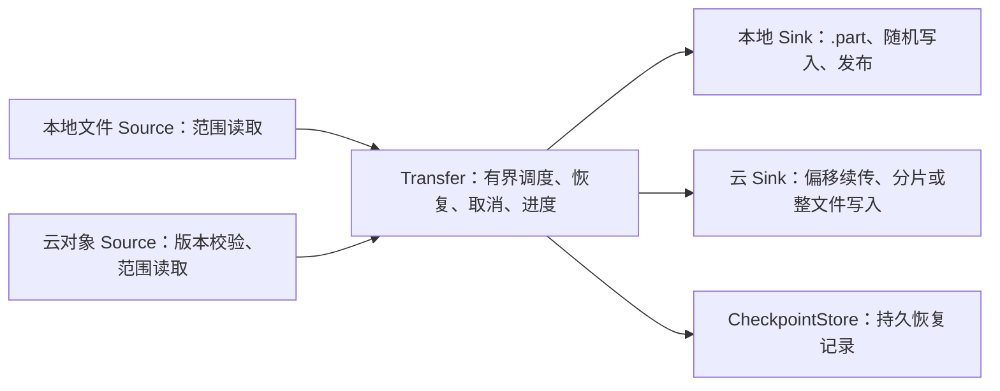
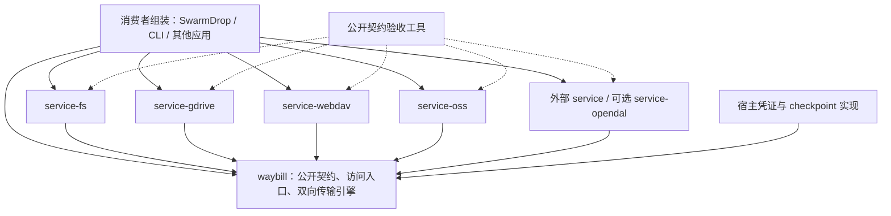
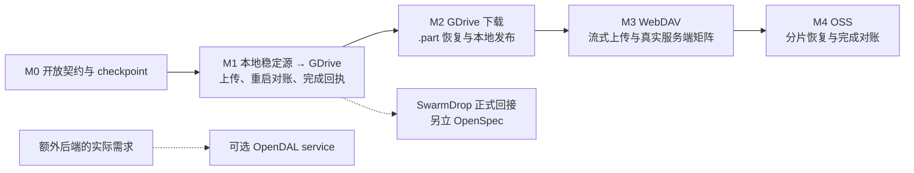

# waybill 设计文档 —— 云端与本地之间的可恢复双向传输

> 起于 2026-10-01 的孵化讨论（源头是 SwarmDrop issue #132 的三后端集成），同日建仓。
> 状态：🟢 **M1 原型开发 —— GDrive 上传与持久恢复，未发布**
> 仓库：<https://github.com/yexiyue/waybill>
> 命名：`waybill`（运单）——回执、在途追踪与交付凭证合一；crates.io 已核未占用
> （`portage` 被 Gentoo 占用出局；`wildgoose` 有 wild-goose-chase 习语陷阱）。
> 与 SwarmDrop 的关系：issue #132 三后端（gdrive / webdav / oss）的云交付需求，
> 加上 host-fs 已有的本地暂存与发布能力，是这个库的起点；SwarmDrop 是首个消费者。
> 关联：SwarmDrop issue #132（云后端决策全记录）、openspec 变更 `cloud-oauth-login` /
> `storage-cloud-gdrive`、SwarmDrop 仓 `dev-notes/knowledge/storage-abstraction.md`。

---

## 0. 先看结论

本轮调研的候选库提供了存储访问、分片和协议客户端等基础能力，但没有直接
满足 SwarmDrop 所需的三后端持久恢复与交付记账。`object_store` 的低层
multipart API 已公开上传 ID，值得参考；这里的缺口需要按具体 API 判断，
不能归结为整个生态或维护者拒绝持久恢复。

建立独立 Rust 库：**自研统一契约和可恢复传输引擎，复用 HTTP、签名与
协议客户端，原生深做少量后端，按需桥接 OpenDAL。** 增强点聚焦跨进程恢复、
有界内存、进度与完成对账，覆盖两个方向：

- **本地 → 云端**：本地范围读取 → 有界调度 → 云上传会话 → 完成回执。
- **云端 → 本地**：云对象版本与范围读取 → 有界调度 → `.part` 随机写入 → 校验与发布。

**从第一天起，OSS、GDrive、WebDAV 与本地文件后端都是独立 service。** 我们
维护的 service 与外部开发者维护的 service 使用相同公开契约，只依赖 core；
增加后端不需要修改核心枚举或合入主仓库。OpenDAL 适配器也遵循这套契约，
在首个实际额外后端需求出现时再实现，优先验证云端下载。

`host-fs` 的通用文件部分进入独立库的本地后端；身份、配对、设备配置和
SwarmDrop 业务适配继续留在应用。当前可复用素材是已落地的 Google Drive
实现与本地文件实现，WebDAV / OSS 仍是计划。市场需求与后端验收需要 spike
验证；首期实现本地稳定源到 GDrive 的上传恢复原型；下载、本地发布、WebDAV 与 OSS 后移。真实故障恢复需独立验收，不继承 SwarmDrop 正常上传探针的结论。

## 1. 动机：三要件是怎么被逼出来的

issue #132 的云目的地需求暴露了现有访问层与交付层之间的差距：

1. **OpenDAL gdrive**：writer 是 `OneShotWriter`（普通上传），写入请求不收用户
   元数据，不暴露 Drive resumable session——标准 writer 不能直接满足这里的
   持久恢复与交付契约。
2. **OpenDAL webdav**：writer 同样 `OneShotWrite`；认证只有 basic/bearer，
   没有 digest——需要补充流式客户端与 Digest 支持，再验收 NAS 矩阵
   （群晖/威联通/坚果云/Nextcloud），不能仅凭服务名声明兼容。
3. **OpenDAL OSS**：multipart 原语齐全，但标准 writer 的上传 ID 与分片列表
   保存在内部；当前公共 writer 契约没有导出和恢复持久会话的入口。
4. **生态其余选项**（见 §3 表）：object_store 提供低层分片会话，OSS 社区
   SDK 提供原生 multipart 操作，reqwest_dav 提供 WebDAV 协议客户端；持久
   checkpoint、源对象校验和应用记账仍需单独编排。

SwarmDrop 的接收管道对云目的地提出的三条硬要求（**三要件**）：

| 要件 | 含义 | 为什么 |
|---|---|---|
| 元数据幂等 | 以回执键（receipt key）查重，命中即视为已完成 | 完成 response 丢失后重试不得产生重复对象；批量上传部分失败重试要能跳过已传文件 |
| 上传恢复 | 上传会话状态可持久化，崩溃重启后先对账服务端已收字节再续传 | 桌面应用随时会被杀；弱网下重传整个大文件不可接受（WebDAV 协议天花板除外，诚实降级） |
| 内存上界 | 流式读写暂存，禁止无界缓冲 | 传输是常驻 actor，一次 OOM 带走整条链路 |

加第四条要求：**凭证注入**——OAuth 后端由账户层提供短期 access token；
WebDAV 接收用户名 / 密码，OSS 接收 AK / STS 凭证，不把它们伪装成 OAuth。
refresh_token / client_secret 与交互授权由宿主拥有，同一凭证只由一个组件
负责刷新，驱动在请求边界获取有效凭证。

云端作为源时，还需要持久化源对象身份、版本与已写区间，并在恢复前确认
来源未变。本地文件最终发布失败时保留暂存，使重试只重做发布。

## 2. 为什么需要独立交付层（待验证的判断）

按孵化期的规矩，检索未发现直接满足需求的库，不足以证明没有等价物
或市场存在空白。以下是当前的架构判断，需要后续消费者与原型验证：

1. **访问操作与恢复任务的生命周期不同。** 统一 read / write API 可以隐藏
   协议差异；跨进程恢复还需要保存源身份、服务端会话、已确认进度和完成状态。
   这部分适合独立状态机，并可以复用已有访问层。
2. **业务恢复规则有真实抽取成本。** 上传对账、下载分块位图、本地发布和
   应用数据库提交的边界不同；需要先分清通用引擎与消费者业务，才能库化。
3. **WebDAV 服务器兼容矩阵是「谁做谁知道」的持续成本。** 库化意味着承诺
   长期扛群晖/威联通/坚果云/Nextcloud 的差异；应用内部做只需覆盖自己的
   用户碰到的服务器。
4. **已有协议能力可以复用。** reqwest_dav、OSS SDK 与 reqsign 减少底层维护量；
   库的价值要由双向恢复与本地发布的完整链路证明，避免重复建设完整云 SDK。

## 3. 生态调研结论（2026-10-01）

| 库 | 已有能力 | 需要补充的交付能力 | 用法建议 |
|---|---|---|---|
| OpenDAL | 多后端访问、范围读取、能力描述、重试与并发；OSS multipart | 标准 writer 的持久会话恢复；WebDAV 流式上传与 Digest 差异 | 可选访问后端与组织方式参考 |
| object_store 0.14.2 | `MultipartStore` 公开上传 ID、分片 ID、完成 / 取消接口 | 接口没有 `list_parts` 和 checkpoint 持久化；不直接覆盖三后端组合 | 参考低层会话设计，按需求适配 |
| reqwest_dav 0.3.3 | Basic / Digest、PROPFIND；PUT 接收 `reqwest::Body` | 请求重建、服务端兼容、完成对账；普通 WebDAV 不承诺上传续传 | WebDAV 客户端候选，可传入流式请求体 |
| ali-oss-rs 0.2.5 等社区 SDK | 原生 multipart 初始化、分片、ListParts、完成 / 取消；文件区间上传 | checkpoint、调度、凭证生命周期；依赖日志与错误处理需审查 | OSS 驱动候选，尚未完成生产选型 |
| reqsign-aliyun-oss | OSS 签名与凭证提供方，支持 V4 / STS | HTTP 协议操作与恢复编排 | 配合 reqwest 实现必要的薄适配器，复用签名算法 |

一手资料：

- [OpenDAL WebDAV 实现](https://opendal.apache.org/docs/rust/src/opendal_service_webdav/backend.rs.html)
  与 [multipart writer](https://opendal.apache.org/docs/rust/src/opendal_core/raw/oio/write/multipart_write.rs.html)
  （另核对发布包 0.59.3；网站源码可能领先于发布版）。
- [object_store MultipartStore](https://docs.rs/object_store/0.14.2/object_store/multipart/trait.MultipartStore.html)。
- [reqwest_dav Client](https://docs.rs/reqwest_dav/0.3.3/reqwest_dav/struct.Client.html)。
- [ali-oss-rs Client](https://docs.rs/ali-oss-rs/0.2.5/ali_oss_rs/struct.Client.html)。
- [reqsign-aliyun-oss](https://docs.rs/reqsign-aliyun-oss/3.2.0/reqsign_aliyun_oss/)。
- [Nextcloud 分块上传扩展](https://docs.nextcloud.com/server/stable/developer_manual/client_apis/WebDAV/chunking.html)。
- [OpenDAL Reader](https://opendal.apache.org/docs/rust/opendal/struct.Reader.html)、
  [Capability](https://opendal.apache.org/docs/rust/opendal/struct.Capability.html) 与
  [Writer](https://opendal.apache.org/docs/rust/opendal/struct.Writer.html)。

以上是 API / 源码调研，真实服务端兼容性、吞吐量与崩溃恢复仍待原型验收。

## 4. 定位与范畴校准

定位为独立的双向交付库，复用 OpenDAL 等访问层：

| | OpenDAL / object_store | 本库 |
|---|---|---|
| 范畴 | 统一的对象**访问**层 | 云端与本地之间的可靠**交付**层（兼访问面） |
| 核心价值 | 一套 API 访问多个后端，按能力提供操作 | 上传 / 下载跨进程恢复、重试对账、本地暂存与发布 |
| 差异处理 | 统一操作与能力描述 | **类型化差异**，进一步描述恢复与发布策略 |
| 类比 | 文件系统 API | rsync / rclone 的传输引擎（库形态） |

把上传恢复、范围读取、源版本校验、随机写入与最终发布分别做成 capability，
调用方按矩阵选择策略。Drive ID、OSS key、WebDAV 路径用后端对象引用表达，
不强制模拟 POSIX 文件系统。回执键是消费者提供的通用操作 ID，不能把设备、
会话或收件箱字段固化成公共类型。

远端完成、本地 checkpoint 和应用数据库之间没有统一事务。库提供持久回执
与重试对账机制，具体幂等保证由后端能力决定，不承诺跨后端 exactly-once。

## 5. 设计方案

### 5.1 访问面与双向交付面

访问面负责 stat / list / range_read 等对象操作，交付面围绕 **Source、Sink、
Transfer** 组织。上传和下载共用恢复、取消、进度与资源调度逻辑；具体的数据
顺序由源 / 目标能力决定。以下上传 API 是契约草图，名称与签名尚未确定：

```rust
// 访问面：熟面孔，覆盖 OpenDAL 的用法；凭证不吃静态 token，吃租约
let service = Gdrive::builder()
    .credentials(cred_provider)   // 每个请求获取有效的短期凭证
    .root(folder_id)               // Drive 根目录由对象 ID 表达
    .build()?;
let op = Operator::from_service(Arc::new(service));
let meta = op.stat(&object_ref).await?;
let bytes = op.range_read(&object_ref, 1024..2048).await?;

// 上传交付面：调用方提供通用操作 ID，不嵌入 SwarmDrop 设备 / 会话模型
let session = op.publish()
    .receipt(operation_id)                                     // 后端支持时查重对账
    .content_hash(blake3_root)                                  // 完整性锚点
    .staged(&staged_file)                                       // 本地暂存的区间读
    .progress(&sink)
    .start()                    // 先查重：receipt 命中 → 直接返回已完成对象
    .await?;
let state = session.checkpoint();   // 不透明、可序列化、由调用方 0600 落盘
// ……进程崩溃……
let session = op.publish().restore(state, &staged_file).await?;  // 先对账 committed 区间
let object = session.complete().await?;                          // 远端确认完成
```

checkpoint 由公共版本化信封与驱动私有状态组成：信封包含操作 ID、后端 / 账户
命名空间、源身份与进度，驱动状态保存 session URI 或 upload_id / 分片列表。
消费者不依赖私有状态结构。由 `CheckpointStore` 负责持久化，文件或数据库
实现由使用者选择；session URI 等敏感状态需要适当保护，0600 只是文件实现
的一项要求。

双向数据流：



| 方向 | 源端契约 | 目标端契约 |
|---|---|---|
| 本地 → 云端 | 稳定源身份、精确范围读取 | 上传会话、远端进度对账、完成回执 |
| 云端 → 本地 | 对象身份 / 版本、范围读取或顺序流 | 暂存、按偏移写入、同步、校验后发布 |

首期聚焦这两条链路。云对象作为 P2P 发送源时，SwarmDrop 通过读取端口桥接；
P2P 网络协议与 bao 验签继续归传输域。不可重读的流若要恢复，需要额外暂存
或声明只能重新开始，不能套用稳定随机读源的恢复保证。

### 5.2 能力模型：类型化降级

| 能力 | 策略或约束 |
|---|---|
| 上传方式 | Drive 连续偏移、OSS 分片、普通 WebDAV 整文件流式写入；Nextcloud 分块扩展单独适配 |
| 上传恢复 | Durable / Restart / Unsupported，按实际驱动能力声明 |
| 源读取 | 范围读取 / 顺序流；声明是否支持对象版本条件校验 |
| 目标写入 | 本地精确偏移随机写 / 连续写 / 分片提交，不用一个 writer 伪装全部行为 |
| 幂等对账 | 元数据回执、确定性对象键、服务端条件操作等；明确可验证范围 |
| 发布 | 同文件系统重命名、远端完成操作、复制到外部位置；分别声明可见性与持久性保证 |

WebDAV 的 MOVE 支持及其实际发布保证需要按服务端验收；对象长度与 ETag
只能作为一致性证据，不能普遍证明内容相同。同 key 覆盖也不能自动防止并发
上传相互覆盖或完成状态不明，必须结合操作 ID、对象版本或预期校验和对账。

OpenDAL 桥接层只暴露实际支持的能力，不统一假定所有后端不可恢复，也不
因为支持范围读取就承诺远端上传会话恢复。

### 5.3 独立仓库的 crate 分层

起步采用一个 Cargo workspace，核心与各 service 独立成 crate；第三方 service
可以在其他仓库独立发布。下列名称仅作示意。各包按实际里程碑创建，提前确定
依赖边界，首期无需为尚未实现的后端创建空包。

| crate | 职责 | 依赖 |
|---|---|---|
| waybill | Service / Source / Sink 契约、capability、访问入口、传输状态机与调度、进度、CheckpointStore、结构化错误；凭证端口属于具体 service | 不依赖 service、SwarmDrop、HTTP 或本地文件实现 |
| waybill-service-fs | 本地范围读取、随机写入、暂存、同步与最终发布 | core + 原生文件实现，按 target / feature 隔离 |
| waybill-service-gdrive | Drive 对象访问、偏移上传会话与恢复对账 | core + HTTP / 协议依赖 |
| waybill-service-webdav | WebDAV 访问、流式上传、服务端差异与可选分块扩展 | core + WebDAV / HTTP 依赖 |
| waybill-service-oss | OSS 访问、分片会话与恢复对账 | core + SDK 或 HTTP / 签名依赖 |
| waybill-service-opendal（条件扩展） | 已配置 Operator 的访问与交付能力适配 | core + OpenDAL；有实际需求再创建 |
| 外部 service crate | 新后端或现有后端的其他实现 | core + 自选协议依赖；可以独立发布 |



独立库的公共契约不依赖 SwarmDrop、Tauri、Specta、收件箱或设备身份模型。
端口与状态机保持平台中立；原生 service 先落地，浏览器的存储、权限与持久化
保证单独声明，不能把 native-only 实现包装成所有 target 都可用。

模块按 object、upload、download、checkpoint、credential、drivers 等职责组织，
类型与行为放在所属模块。库拥有调度和恢复，协议驱动只执行其能力范围内的
操作；HTTP / TLS、签名与 XML 解析优先复用。OpenDAL 桥接减少后端客户端
维护量，新增后端的交付保证仍需单独验收。

未来若提供聚合入口包，可以用 feature 重导出常用 service；它只负责便利性，
不持有后端实现或封闭分派逻辑。service 开发者不必依赖这个入口包。

### 5.4 三后端语义对照（= 各 checkpoint 模块的需求差异）

| | 恢复机制 | 发布与完成确认 | 幂等判据 |
|---|---|---|---|
| Google Drive | resumable session URI + 服务器字节数查询 | 完成后确认对象，响应丢失时重新查询 | appProperties 回执键与对象 ID 对账 |
| 普通 WebDAV | 重试重传整文件；Nextcloud 等扩展另行声明 | PUT 临时对象 → MOVE，实际保证按服务端验收 | 操作对应路径、长度 / ETag 等证据；无可信哈希时不宣称内容一致 |
| OSS | multipart upload_id + ListParts 对账 | CompleteMultipartUpload 后查询完成状态 | 确定性 key + 操作身份 / 预期校验和 / 对象版本，不能只凭同 key |

### 5.5 云端 → 本地：恢复与发布生命周期

1. 获取云对象引用、长度、版本 / 校验和，生成通用传输 ID。对象 ID 和版本
   分开记录，恢复时确认版本未变；不支持条件读取的后端降低一致性保证。
2. 创建或重新打开本地 `.part`，关联源身份与已完成区间。不能仅凭文件长度
   判断已收齐，因为暂存可能已预设长度而尚有未写区间。
3. 对缺失区间做有界范围预读，按精确偏移写入；不支持 Range 时采用顺序
   下载或整文件重传。并发数、分片大小与预读窗口共同约束内存及在途任务。
4. 数据写入并同步后，才持久记录相应区间已完成；崩溃窗口中未确认的数据
   可以重读重写，不能让 checkpoint 宣称尚未持久化的数据已完成。
5. 校验完成后进入可发布状态。有可信预期哈希时验证内容；P2P 路径可以接收
   bao 已完成校验的结果；普通云下载若只有长度 / 版本，只声明相应一致性
   级别，ETag 不统一视作内容哈希，也不把本地算出的哈希当作来源证明。
6. 发布到用户目标位置：同文件系统走重命名，跨文件系统或系统文档提供方
   走明确的复制策略。关闭 / 排空写任务、同步与发布的顺序需由契约保证。
   发布失败保留暂存与完成状态，只重试发布，避免再次下载整个文件。
7. 持久化完成回执，由消费者确认业务记账后清理恢复状态。最终路径 / URI
   以目标实现返回值为准；发布成功但回执未写入的窗口需能查询对账。

上传和下载共用操作身份、checkpoint 存储、错误分类、取消与进度模型；
恢复状态分别保存远端已确认偏移 / 分片，以及本地已持久化区间。区分已发送
或已读取字节、确认持久化字节与最终完成，不让进度 100% 代替发布成功。

### 5.6 从 host-fs 抽取通用文件能力

现有素材（位于 SwarmDrop 仓库）：`crates/host-fs/src/local_fs/mod.rs`、
`crates/host-fs/src/local_fs/part_file.rs`、`crates/host-fs/src/local_fs/sink_ops.rs`。
它们已实现本地范围读取、精确偏移写入、`.part` 重开与发布；完整的下载
恢复 / 校验链路仍需新增。

| 后续抽取到 service-fs（首期仅稳定源与 checkpoint） | 保留在 SwarmDrop |
|---|---|
| 范围读取、按偏移写入、暂存创建 / 重开、同步、发布与清理 | 身份、配对设备、设备配置的 JSON 存储 |
| 通用路径边界检查与目标冲突策略 | FileAccess 端口适配、CoreSaveLocation 和 UI 选址 |
| 通用操作 ID、源身份、恢复记录与完成回执 | P2P、bao、ReceiveFileIdentity、收件箱记账 |

`LocalFileAccess` 后续变成新库的薄适配层，现有暂存与发布保证必须保留。
Android SAF / iOS 外部位置在发布阶段适配，不能假定其句柄适合随机写；
Web 存储也有独立实现与能力声明。

当前 SwarmDrop 仓 `crates/storage-cloud/src/file_access.rs` 的
source_metadata / read_source_chunk 仍委托本地实现，云对象作为发送源尚未
接入。后续同时补云读取适配和本地接收适配，避免独立库只覆盖上传一半。

### 5.7 第三方 service 的公开扩展契约

扩展性是首期设计要求。官方维护的 service 也只通过公开 API 接入，不使用
core 私有模块、特殊分支或后门。外部开发者应能创建一个只依赖 core 的 crate，
完成自己的协议实现，再由消费者直接注入统一入口与传输引擎。

| 扩展点 | 开发者需要实现或提供的内容 |
|---|---|
| Service / ServiceInfo | 稳定 service 标识、实例命名空间、当前配置下的 capability，构造 Source / Sink 的入口 |
| Source | 元信息、顺序或范围读取、可用的源版本校验；只实现声明支持的模式 |
| Sink / 上传会话 | 对应连续偏移、分片或整文件模式的写入、完成与取消；持久恢复作为独立可选契约 |
| 恢复协议 | 私有状态的版本化编码 / 解码、服务端对账、会话过期与结果未知的处理 |
| 对象访问 | 可选 stat / list / delete 等操作；未支持操作返回结构化 Unsupported |
| 凭证与请求配置 | typed builder 与凭证提供方；HTTP 连接配置由具体 service 暴露，核心不绑定某个 SDK |
| 错误映射 | 转换为 core 的稳定错误类别，同时保留可诊断的后端来源与请求标识 |

最小 service 可以只支持读取；支持上传后再按协议加入恢复与对账契约。不能
要求每个开发者实现所有方法，也不能用默认成功掩盖未实现能力。capability
反映当前实例与服务端实际保证，传输策略要求的能力不足时，在开始前明确拒绝；
只有消费者显式允许时才采用整文件重传等降级策略。

为避免扩展受主仓库限制，公共模型需要满足：

- **标识开放**：ServiceId 使用带命名空间的可校验标识，不把 provider 封闭
  为 Gdrive / Webdav / Oss 枚举；新 service 无需给 core 增加 enum 分支。
- **契约可在外部实现**：扩展 trait 不 sealed，必需的参数、结果类型和构造器
  均公开。核心调度只依赖契约与能力，不能按 service 名称切换算法。
- **对象与恢复状态可携带厂商信息**：对象引用、checkpoint 公共信封包含
  service / 实例身份和格式版本，厂商定位信息与私有状态保持不透明。恢复
  不匹配、缺失驱动或版本不兼容时返回明确错误并保留记录。
- **实例边界明确**：同一 service 的不同账户、端点、bucket 或根目录必须
  隔离恢复记录与对象引用；私有状态不进入通用日志。
- **写入模式分开扩展**：偏移、分片、整文件与本地随机写遵循各自契约。
  支持新后端可复用现有模式；出现新的传输语义时，通过演进核心契约承载。

两种接入方式，以下为 API 草图，为长期规划，首期接口见 §11：

```rust
// Rust 应用直接使用外部 crate，只依赖公开 service 契约
let service = Acme::builder().endpoint(endpoint).credentials(creds).build()?;
let op = Operator::from_service(Arc::new(service));

// CLI / 配置驱动宿主显式注册工厂，再从配置构造实例
registry.register(ServiceId::parse("acme:object-store")?, AcmeFactory::new())?;
let service = registry.build(&config, &host_context).await?;
```

直接注入是基础路径，不要求 registry。配置注册由可选的公开工厂接口支持，
注册表归消费者所有，重复标识拒绝注册；不用进程全局隐式注册，不默认启用
所有 service。首期通过 Rust crate 静态链接扩展，动态共享库 ABI 另行评估。
工厂公开配置校验与版本信息，秘密以宿主引用或凭证接口注入。

core、service 契约及公共信封使用明确的版本兼容规则，新增能力通过独立可选
契约或兼容的默认 Unsupported 演进；稳定版破坏性修改提升主版本，0.x 阶段
明确次版本兼容边界与迁移说明。具体 Rust trait
的异步形式、类型擦除方式与跨 target 约束首期采用对象安全 boxed future，确保配置构造出的实例
也能注入引擎，避免只有编译期泛型路径可用。

### 5.8 第三方 service 的开发与验收入口

从 M0 准备最小只读 service 示例、完整会话示例和 service 开发指南；在 M1
用独立消费者 crate 演示仅通过公开 API 接入，作为公开边界的验收依据。
共享契约验收工具按声明的能力选择场景，不强制只读 service 通过上传测试。

开发者接入流程：

1. 新建 service crate，依赖兼容版本 core，实现 typed builder 与实例能力。
2. 实现需要的 Source / Sink 和协议操作，映射结构化错误。
3. 按能力实现 checkpoint 与恢复对账；复用核心调度、持久化和进度模型。
4. 使用公开验收工具检查范围读取、源版本、写入 / 同步顺序、取消与资源上界。
   声明持久恢复的 service 还需覆盖重启、凭证变化、会话过期和完成响应丢失。
5. 发布独立 crate，并提供支持的平台、协议扩展、恢复保证及已验证服务端矩阵。
   消费者直接注入或显式注册，无需等待主仓库收录。

## 6. 消费者场景（库存在的产品理由）

| 消费者 | 用法 | 对库的约束 |
|---|---|---|
| SwarmDrop 桌面 / CLI | 接收目的地落云、云对象作为发送源、本地暂存与发布 | 会话 / 凭证分层；宿主端口适配；capability 驱动 UI 文案 |
| 独立 CLI 工具 | 批量上传、云文件下载到本地目录、弱网下重启恢复 | URI scheme 表达后端与对象；TTY 进度；凭证配置；目标冲突策略 |
| ComfyUI / agent | 生成的图片上传云端：CLI 子进程（最便宜）或 MCP server（agent 原生，`cloud_upload(files, destination_uri)` 一个工具参数即 URI） | **批量小文件是一等公民**：receipt 幂等让批量部分失败重试自动跳过已完成项 |
| CI / 无头场景 | 宿主提供 OAuth token、WebDAV 密码或 OSS AK / STS 凭证 | OAuth 流程与秘密持久化归应用层，库通过凭证接口执行请求 |

## 7. 里程碑



M1 交付独立库与公开 API 消费者示例，不替换 SwarmDrop 主线。首期验证 Linux / macOS，
rust-version 1.88（2026-10-01 起统一，不再维护更低版本）。API 仍为 0.x 原型；完整稳定化须经过双向链路与更多后端验证。
真实 GDrive 重启、会话过期及完成响应丢失测试与本地 HTTP 替身测试分别记录。

## 8. 与 OpenDAL 的关系（三重）

1. **参考设计**：capability、后端组织、服务矩阵、结构化错误；同时参考
   object_store 的低层 multipart 契约。按本库的双向传输需求组织模块与 crate。
2. **桥接**：额外后端的实际需求出现后，提供独立、可选的 service-opendal，
   与其他 service 使用相同公开契约，普通访问与交付能力分别声明。
3. **上游协作**：原型成立后可以讨论版本化持久会话与进度对账。上游是否
   接受尚未确认，本库设计不依赖该结果。

明确**不做**：OpenDAL API 兼容层（覆盖其用法，不克隆其签名——追别人的 API
尾巴永远追不完）；多语言绑定；presign；Layer 中间件体系（v2 再议）。

### 8.1 桥接的收益按传输方向判断

| 用途 | 桥接收益与边界 |
|---|---|
| 查询 / 列表 / 删除 | 复用协议操作；按 capability 映射可选接口 |
| 云端 → 本地 | 范围读取与稳定版本校验可复用；本地已持久化区间由我们的引擎记录，补读缺失区间实现下载恢复 |
| 本地 → 云端 | 支持有界流式写入时可复用；恢复原远端会话、完成对账仍须逐后端判断 |

下载恢复状态可以由本地引擎拥有，上传恢复还依赖远端会话。源端支持范围读取
及可靠版本校验时，桥接 service 可组合出持久下载恢复；只有 stat、长度或
不稳定 ETag 时，不能宣称同等保证。标准 Writer 的 write / close / abort 接口
不自动提供跨进程上传会话恢复。

### 8.2 桥接的准入与维护边界

- 使用者可以传入已配置的 Operator，负责提供其端点、凭证与有效的更新机制。
  适配器不要求 core 识别 OpenDAL 的每个 builder，也不假设所有后端都能通过
  同一个凭证钩子刷新；恢复记录需要额外绑定稳定的 service / 实例命名空间。
- 下载恢复、上传恢复、完成对账、发布保证分别声明并验收。消费者要求持久
  续传而后端不满足时明确拒绝，不能自动改为整文件重传。
- 范围预读、上传分片与 OpenDAL 内部并发共同计入资源预算。明确调度与重试
  的拥有者，限制内部并发、缓存与重试次数，避免两层调度放大在途请求。
- 桥接节省协议实现工作；凭证更新、错误映射、取消、源版本与真实服务端
  兼容性仍需维护。优先在首个额外后端上验收下载，再按需求扩大上传能力。

OpenDAL 的原生 / 完整 capability 可以作为映射输入，适配器还需表达本库
组合后的交付保证。验收支持范围和动态服务端约束要显式声明，不能把原生
capability 原样复制为所有交付能力。

## 9. 风险明账

1. **API 面规模**：双向交付涉及云源、本地源、本地暂存与云会话。缓解：访问面
   做窄（range_read / list / stat / delete），首期只覆盖云与本地之间的传输，
   不扩展为同步工具或完整文件系统。
2. **真机矩阵是持续成本**：WebDAV 服务器兼容矩阵 + OSS 签名版本跟进 + issue
   响应。这是第二主线，SwarmDrop 主线（传输）的排期不被它阻塞——里程碑已按
   此原则编排。
3. **OpenDAL 版本漂移**：桥接层钉版本 + 升级核对。
4. **过早抽象**：API 先通过 Drive + WebDAV + 本地 Sink 的双向契约验收再稳定化，
   OSS 的分片对账进一步检验恢复模型；驱动不能统一伪装成随机写文件。
5. **本地恢复的持久性**：写入、同步、checkpoint、发布与回执有多个崩溃窗口。
   需要按边界验证恢复行为，文件长度和 rename 成功不能代替完整的持久性保证。
6. **性能与资源预算**：范围预读、分片并发、重排缓存与磁盘任务必须有上界。
   分开测量云读取 / 写入、本地 IO 与 P2P 吞吐，记录网络、区域、限流和基线；
   并发配置不代表固定带宽承诺。
7. **扩展 API 维护成本**：公开 trait、状态信封与 service 版本有兼容性责任。
   以独立消费者示例和按能力运行的契约验收约束演进，不让官方后端依赖私有
   API，避免第三方只能 fork core 才能适配。

## 10. 未决问题

- ~~**命名**~~ **已定稿（2026-10-01）**：`waybill`（运单）——回执、在途追踪、
  交付凭证三语义合一，双向中性，CLI 工学友好（`wb put / get`）。核查：
  crates.io 未占用（404）；`portage` 被 Gentoo 包管理器占用出局；
  `wildgoose` / `snowgoose` 空闲但有 *wild goose chase* 习语陷阱；`godwit`、
  `courier`、`lading`、`yam` 均已被占用。吉祥物 **Bill**（雁哥）：腿绑运单筒
  的邮差鸿雁——双向迁徙、湿地补给、年年归巢、雁阵领飞分别对应双向传输、
  checkpoint、回执幂等与分片并发；Bill 同时双关雁喙（beak）与 way**bill**。
  M0 契约稳定后尽早 `cargo publish` 占名。
- **建仓与首期范围**：~~尚未创建仓库~~ **已建仓**（本仓库）。独立 Cargo
  workspace，core 与各 service 独立成包；以 service-fs + service-gdrive
  验证上传恢复及外部接入，再按 GDrive 下载 → WebDAV → OSS 接入；OpenDAL 桥接按实际需求触发。
- **checkpoint 状态格式**：不透明 blob 的版本化策略（库升级后旧 state 能否
  restore）——首期公共信封与驱动均使用版本 1，未知版本拒绝恢复并保留记录。
- **校验与冲突策略**：来源缺少可信预期哈希时如何向消费者表达保证；同名目标
  的拒绝 / 覆盖 / 重命名规则；跨盘与外部文档提供方的发布回执如何对账。
- **平台范围**：首期原生实现为 Linux / macOS；SAF / Web 适配时机与能力边界待定。
- **公开扩展签名**：首期采用开放 trait 和 Send boxed future；工厂 / registry 后续设计。
  0.x API 仍可演进，破坏性变更须升次版本并提供迁移说明。
- **SwarmDrop 回切时机**：M1 后可评估局部接入，完整接入另立 OpenSpec 变更。

## 11. 首期落实契约与源码证据（2026-10-01）

本节描述 M1 实现约束，§5 中 Operator / registry 等草图属于长期设计，不是既有 API。

- 核心仅定义开放 Service、Source、UploadSink、CheckpointStore、资源预算与上传状态机。
  公共异步返回 Send boxed future，不绑定 Tokio、HTTP、本地路径或应用身份。
- service-fs 首期提供稳定文件源、精确范围读取、BLAKE3 身份和文件 checkpoint；下载
  Sink / 随机写暂存 / 最终发布尚未实现。宿主必须在上传期间冻结源文件。
- service-gdrive 使用短期凭证端口；OAuth 和刷新持久化由宿主负责。实例绑定账户、
  OAuth 应用与根目录。使用通用操作 ID，默认拒绝同名目标；显式选择可加操作后缀另存。
- checkpoint 公共格式版本与驱动私有格式版本分别验证，绑定源、目标与实例。先保存
  对象 ID 再初始化上传；远端完成后先保存回执，消费者确认记账后才清理恢复记录。
- 会话过期先查完成对象；未完成默认返回 SessionExpired 并保留记录。显式允许
  重建时每次运行最多两次，进度表达重新开始。暂停停止后续块，先对账在途结果。
- 默认上传块 8 MiB，共享预算最多两条上传、16 MiB 数据缓冲；校验块 256 KiB，
  单个元数据响应及 checkpoint 上限 1 MiB，元数据列表最多 1000 项。无目录缓存。
  HTTP 超时 60 秒；限流 / 5xx 最多三次重试、单次等待最多 30 秒。上传 PUT
  结果未知后先查偏移，不盲目重发；初始化 POST 使用已持久化 ID 收敛重试。
- 文件 checkpoint 以 0600 临时文件、同步、替换、目录同步落盘；操作锁覆盖整个
  恢复和确认过程。源、凭证、私有状态不写 Debug / 日志。hash 属性是操作对账证据，
  不证明远端内容完整性，也不承诺跨进程并发同名目标的统一原子发布。

抽取基线：SwarmDrop `0a81f133214958f7b01ae9a0e4624dc87e16014b`，
`crates/storage-cloud/src/{gdrive,staging,persistence,publish}`。MIT 来源声明随衍生代码保留。
只复用协议和恢复机制，不复制设备目录、接收记录模型、CloudAccountManager 或 UI 类型。
SwarmDrop 的 17 MiB 真机探针确认正常分块上传、属性查询及重复接收复用；重启、过期、
完成响应丢失尚未验收。目录源码的 let chains 当时为兼容 Rust 1.85 改写；
2026-10-01 起 rust-version 统一为 1.88，新代码可直接使用 let chains。

本轮源码复核：本机缓存 OpenDAL core 0.59.2 的 MultipartWriter 上传 ID 为私有状态；
[公开 GDrive backend](https://opendal.apache.org/docs/rust/src/opendal_service_gdrive/backend.rs.html)
使用 OneShotWriter（网站源码未固定发布版本，不外推所有版本）。
[object_store 公开 multipart 源码](https://github.com/apache/arrow-rs-object-store/blob/main/src/multipart.rs)
提供低层上传 ID，但不直接提供本项目 checkpoint 编排；首期均不作为依赖。
[Google resumable 协议](https://developers.google.com/workspace/drive/api/guides/manage-uploads)
定义 308 偏移查询、404 过期与非末块 256 KiB 对齐。
未在本轮重新核验的 §3 其他库版本、CLI 市场数据及占名状态保留原日期，仅作历史调研。

waybill 独立库的本轮分层验收见 [VALIDATION.zh-CN.md](VALIDATION.zh-CN.md)：
本地 HTTP 故障替身与真实 Drive 验收分别记录，不继承上游探针的故障恢复结论。
